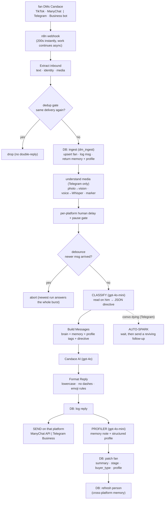

# automation/ — Candace's conversation system (TikTok + Telegram)

Candace replies to her DMs automatically, in her own voice, on **two platforms
that share one brain and one durable memory**. This doc is the **master reference**
for the whole conversation engine — the classifier, the reply, the profiler, the
structured profile, cross-platform memory, auto-spark and re-engage.

- **TikTok** (this file, §3): fans DM her via **ManyChat**; her job is to be
  magnetic and **funnel** interested men to her private Telegram.
- **Telegram** ([`telegram/README.md`](./telegram/README.md)): a **Telegram
  Business bot** answers as the real account; her job is **retention** — make
  them crave her. Telegram also **understands media**, **asks qualifying
  questions**, and can **auto-spark** a dying convo.

Both surfaces run the **same engine** (dedup → memory → delay → debounce →
classify → reply → profile). The differences are called out throughout.

---

## The big picture



**Separate entry point — Re-engage** (dashboard button / webhook): when a convo
has gone quiet, one workflow reaches out *first* with a fresh, memory-aware
opener. See §5.

**One brain, two surfaces.** Each platform is a row in `bots`
(`candace_summers` = TikTok, `candace_telegram` = Telegram). Personality, model
and pacing live in the DB, so behaviour is edited without touching n8n.

---

## 1. The pieces

| Piece | Role |
|---|---|
| **TikTok / ManyChat** | ManyChat watches the TikTok inbox, fires on a new message, calls n8n, and receives her reply back via the ManyChat Send API. |
| **Telegram Business bot** | `@candace_auto_bot` connected to the real `@candace_summers` account; answers on her behalf via `business_connection_id` (no "bot" badge). |
| **n8n** | the orchestrator: dedup, memory, media, delay, debounce, classify, OpenAI, profile, send, spark. |
| **Supabase (Postgres)** | durable memory + personality + structured profile + full logs + queue events. Multi-bot, cross-platform. |
| **OpenAI** | the reply (`gpt-4o` + vision), the per-message **classifier** and **profiler** (`gpt-4o-mini`), and **Whisper** for voice notes. |

---

## 2. The two AI passes that make her feel human

Every reply is wrapped by two cheap `gpt-4o-mini` passes. This is the "amazing but
complex" part — read this before touching a workflow.

### 2a. The CLASSIFIER (before the reply) — "a read on him for THIS turn"
A fast, silent pass reads his latest message + recent context and returns **one
JSON object** that steers the reply. It never writes her words; it hands the main
model a directive.

**TikTok classifier** (`Build Classify Request` → `Classify`):
| field | meaning |
|---|---|
| `archetype` | sweet / cocky / shy / provider / submissive / lowffort / hostile / normal |
| `intent` | greeting, compliment, question_about_her, sexual, bot_test, wants_more, wants_to_meet, vulnerable, boring, insult, … |
| `effort` | low / medium / high |
| `funnel` | true only when it's the right moment to give the Telegram |
| `ask_back` | should she end with a question (default false, ~1 in 5) |
| `directive` | ≤22-word instruction for how she plays this reply |

**Telegram classifier** adds the retention + profiling controls:
| extra field | meaning |
|---|---|
| `convo_health` | healthy / cooling / stale |
| `spark` | true → after replying, fire a reviving follow-up (auto-spark) |
| `ask_profile` | true (sparingly) → slip in ONE casual qualifying question |
| `profile_topic` | which unknown fact to get curious about (from the gaps) |

> The classifier — **not the prompt** — decides *when* to funnel, ask back, spark,
> or profile. That keeps behaviour consistent and low-drift; the prompt just
> executes the directive in her voice.

### 2b. The PROFILER (after the reply) — durable memory
A second pass reads the whole exchange and updates what she knows:
- an honest **read**: `attachment_score`/`intent_score` (0–100), `stage`,
  `buyer_type`, `temperature`, `signals[]`, `technique`, `next_move`;
- a **memory `note`** (prose, "told not witnessed", never dropped facts);
- a **structured `profile`** object (see §4).

Stored in `fans.summary` + `fans.metadata` + `fans.profile`, and stamped with
`last_interaction_ts` (which the dedup gate reads).

---

## 3. TikTok async workflow, node by node

Workflow: **`n8n/candace_manychat_async.json`** (webhook `candace-manychat-async`).
This is the production path. Older JSONs are simpler references.

1. **Webhook (ManyChat)** — `responseMode: onReceived`; 200s instantly, rest runs
   in the background so ManyChat never waits.
2. **Extract Inbound** — `msg` (`last_text_input`), `username`, `display`,
   `subscriber_id` (**required** — how the reply is sent back), `interaction`
   (`tiktok_lastinteraction`, for dedup).
3. **Dedup: read fan → gate** — ManyChat/TikTok can re-deliver the same inbound.
   The gate drops a message whose `interaction` timestamp we've already handled,
   so she never double-replies.
4. **DB: ingest** (`dm_ingest`) — upsert fan, log inbound, bump `msg_count`, and
   return `{ bot_id, fan_id, summary, stage, count, recent[], system_prompt,
   model, person_summary, profile }`. Logging happens **immediately**, so a whole
   burst is recorded in order before she replies.
5. **Set Delay** — random aloof delay: mostly **120–600s**, ~15% a quicker
   **45–120s**. Captures the resume URL (for the dashboard "send now").
6. **Q: enqueue** (`events` `dm_queued`) — records the delay + scheduled time.
7. **Wait** — resumes on the delay **or** the "send now" resume webhook.
8. **DB: get fan → Check Latest** (**debounce**) — if a newer message arrived,
   this run **aborts**; the newest run answers the whole burst (all messages were
   logged in step 4).
9. **Build Classify Request → Classify** — the read on him (§2a).
10. **Build Messages** — assembles OpenAI `messages`: `messages[0]` = **her full
    personality from the DB** (byte-identical → prompt-caching); then memory
    `summary`; then a stage note if already funnelled; then the classifier
    directive; then recent turns. (TikTok does **not** inject the structured
    profile into replies — it only *captures* it; see §4.)
11. **Candace AI (gpt-4o) → Format Reply** — generate, then deterministically
    enforce style: lowercase, strip dashes, only `😏 🤭 🤍 👀`, ≤1 emoji, fallback.
12. **DB: log reply** (`dm_log_reply`).
13. **ManyChat: send reply** (`sendContent`, `content.type:"tiktok"`).
14. **Q: sent** (`events` `dm_sent`).
15. **Profiler branch** (parallel from 12): **Build Profile Request → Profiler →
    Apply Profile → DB: patch fan → DB: refresh person** (§2b, §4). If the reply
    gave the Telegram, stage is bumped to `funnelled`.

> **Send API gotcha:** the body must set `content.type:"tiktok"`, else ManyChat
> defaults to Messenger and fails the 24h-window check (`code 3011`).

---

## 4. The structured profile (raw facts, cross-platform)

Alongside the prose memory, the profiler keeps a small **`fans.profile` jsonb** of
raw facts, injected back so she references what she knows:

`name · age · location · occupation · relationship · interests[] · guessed_salary`

- **Telegram = full loop.** The classifier decides — sparingly — when she gets
  casually curious and slips in **one** natural qualifying question about a gap
  (never an interview), and every reply is fed the known tags.
- **TikTok = learn-only.** She never asks (the job there is the funnel), but any
  fact he volunteers is still captured into the same profile.
- **`guessed_salary` is the one *inferred* field** — a rough income estimate from
  job/lifestyle/spending. It is **never shown to Candace** (excluded from her
  reply context); it's for buyer-type strategy and the dashboard only.
- **Cross-platform merge.** `dm_ingest` returns the profile merged across a
  person's linked fan rows — **per key, the most-recently-seen linked fan wins** —
  so a fact learned on TikTok shows up when he lands on Telegram, and vice-versa.

Viewable/editable on the dashboard fan page (Profile panel).

---

## 5. Re-engage (restart a quiet conversation)

Workflow: **`n8n/candace_reengage.json`** (webhook `candace-reengage`). Triggered
by the dashboard "↻ Re-engage" button (or `POST {fan_id}`).

`Extract → DB: fan (+ profile, manychat_id) → DB: recent → Build (opener, memory-
aware) → AI → Format → DB: log reply → Platform? → Send: telegram | Send: tiktok`

- She reaches out **first** with one short, natural, on-brand opener (no
  guilt-trip), using a remembered detail when it fits.
- **Platform-aware send:** Telegram via the Business API
  (`business_connection_id` + `chat_id` from `fans.metadata`); TikTok via ManyChat
  `sendContent` keyed by **`fans.manychat_id`** (the column, not metadata).

---

## 6. Auto-spark (Telegram only)

When the classifier flags `convo_health` cooling/stale with enough history, the
`Spark?` branch fires **after** her reply: wait a short beat, then send ONE
playful follow-up that revives the thread (built from the conversation, in voice,
logged like any message). Keeps her from letting a dying chat die.

---

## 7. Supabase side

Schema + RPCs: `supabase/schema.sql`. Personalities: `supabase/candace_prompt.sql`
(TikTok) and `supabase/candace_telegram.sql` (Telegram).

**Tables**
- `bots` — one row per surface. Holds `system_prompt` (personality), `model`,
  `reply_delay`, `automation_paused`, `settings` (e.g. Telegram `spice`).
- `fans` — one row per fan per bot per platform. `summary`, `stage`, `buyer_type`,
  counts, `metadata` (scores, signals, technique, next_move, `last_interaction_ts`,
  Telegram `chat_id`/`business_connection_id`), `manychat_id` (TikTok subscriber),
  **`profile`** (structured facts), `person_id` (cross-platform link).
- `persons` — a real human across platforms; `summary` is their shared memory.
- `messages` — every inbound/outbound message, forever.
- `events` — audit + queue log (`inbound_message`, `dm_queued`, `dm_sent`, …).

**Key RPCs**
- `dm_ingest(...)` — upsert fan + log inbound + return context **incl. the
  cross-platform-merged `profile`**.
- `dm_log_reply`, `dm_set_stage` — write-backs.
- `dm_link_person` / `dm_unlink_fan` / `dm_refresh_person` — cross-platform links.

Memory is durable (Postgres, backed up, queryable) and isolated by `bot_id`.

---

## 8. Where her personality lives (important)

Her **full personality is in the DB** (`bots.system_prompt`), not hard-coded in
n8n. Edit her voice by changing `candace_prompt.sql` / `candace_telegram.sql` and
re-running — no workflow change. The short brain in `Build Messages` is only a
fallback if the DB prompt is empty.

Confirm the full prompt is live:
```sql
select slug, model, length(system_prompt) as chars, left(system_prompt,80) as start
from bots where slug in ('candace_summers','candace_telegram');
```
`chars` ≈ **9,000+** and `start` begins *"You are Candace Summers, a 21 year old
woman from columbus, ohio…"*.

---

## 9. Cost & models
- Reply: **`gpt-4o`** (+ vision on Telegram photos). ~$0.005/reply, less cached.
- Classifier + profiler: **`gpt-4o-mini`**. Voice: **Whisper** (Telegram).
- Roughly **$5–8 per 1,000 DMs** including the classifier/profiler passes.

---

## 10. Live n8n workflows (reference)

| Workflow | id | Path | Role |
|---|---|---|---|
| **Candace ManyChat ASYNC** | `48WOVR3dC78VxYN8` | `/webhook/candace-manychat-async` | TikTok production responder |
| **Candace Telegram BUSINESS** | `RDkiIWzAaK4Fxchd` | `/webhook/candace-business` | Telegram production responder (real account) |
| **Candace Re-engage** | `hqBtp3xvH6cGFWkr` | `/webhook/candace-reengage` | restart a quiet convo (both platforms) |
| Candace Queue / Admin API | — | `/webhook/candace-queue*`, `…-fans/link/unlink` | dashboard read/link APIs |

Deploy pattern (used all along): fetch the live workflow, patch the changed node
code, inject `__BOT_TOKEN__`, re-bind creds (`supabaseApi`, OpenAI Bearer,
ManyChat header), `PUT /workflows/{id}`, activate. Keep the committed JSON in
`n8n/` in sync. **Secrets are never committed** (n8n credentials / server `.env`).

---

## 11. Admin dashboard

Full control panel (Node/Express + vanilla SPA) at `http://134.199.145.47`, on the
`claude/admin-dashboard-multi-account-i2zcpq` branch under `dashboard/`
(auto-deploys via GitHub Actions). One "Candace" identity with a TikTok ⇄ Telegram
switch; merged-but-filterable Fans + Queue; per-fan Conversation, Funnel, Memory,
**Profile**, and cross-platform **link/unlink**; pacing + pause; content Studio;
and a live queue with "send now".
