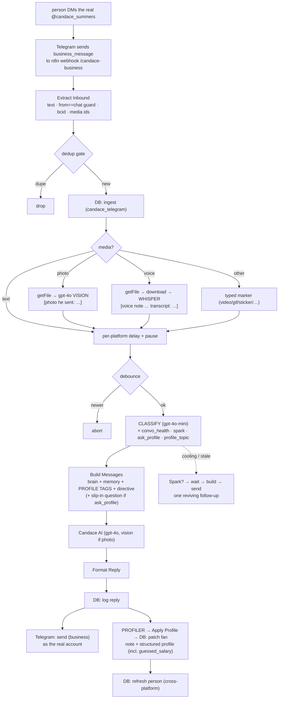

# automation/telegram/ — Candace on Telegram (talk & retain)

Candace on **Telegram**, reusing the same brain + memory as the TikTok system
([`../README.md`](../README.md) is the master doc). Her job here: **make them
crave her** — more personal than TikTok, **no funnel, no selling**. Spice stays
**tasteful** for now (a `settings.spice` dial that can be raised later).

Telegram runs the shared engine **plus** three things TikTok doesn't:
**media understanding**, **qualifying questions** (structured profile), and
**auto-spark** for a dying conversation.

> ⚠️ **Live connector = the Telegram Business API, not the bridge.** People DM the
> real **@candace_summers** account and a connected **Telegram Business bot**
> (`@candace_auto_bot`) answers on her behalf via `business_connection_id` — no
> "bot" badge, no userbot. The old **Telethon `bridge/`** is kept as an
> alternative/reference only; the production path is
> **`../n8n/candace_telegram_business.json`**.

---

## Data flow

Everything between `dm_ingest` and the send is the **same engine** as TikTok
(delay, debounce, dedup, classifier, profiler, prompt-caching). See the master
doc §2 (classifier + profiler) and §4 (structured profile).

---

## What's different from TikTok

- **Real user account, not a bot** — the Business API bot answers inside the real
  account's DMs; replies carry `business_connection_id`. No "bot" badge.
- **Separate bot row `candace_telegram`** with its own `system_prompt` (retention,
  not funnel). TikTok stays locked.
- **Understands media** — photos → **gpt-4o vision**, voice notes → **Whisper**,
  and video/gif/sticker/file/location/contact → a clear typed marker. The
  interpretation is logged (`[photo he sent: …]`), shown in the dashboard
  conversation + queue, and fed to memory. (ManyChat doesn't forward TikTok media,
  so TikTok stays text.)
- **Asks qualifying questions** — the classifier (`ask_profile` + `profile_topic`)
  occasionally has her get casually curious about ONE unknown fact; answers build
  the structured `fans.profile` (master doc §4). TikTok is learn-only.
- **Auto-spark** — when `convo_health` is cooling/stale, the `Spark?` branch sends
  a reviving follow-up after her reply so a dying chat doesn't die.
- **Per-bot delay + pause** — `bots.reply_delay` (more present than TikTok's
  2–10 min) and `bots.automation_paused`, both tuned from the dashboard.
- **Cross-platform memory** — the `persons` table links a Telegram fan to their
  TikTok history; shared `summary` + merged `profile` follow the person. Linking
  is manual in the dashboard.

---

## Live Telegram workflow, node by node

Workflow: **`../n8n/candace_telegram_business.json`** (id `RDkiIWzAaK4Fxchd`,
webhook `candace-business`, POST).

1. **Webhook (Telegram Business)** — receives `business_message` updates.
2. **Extract Inbound** — requires `business_connection_id`; only handles a private
   chat where `from.id == chat.id` (skips the owner's own outgoing + the bot's
   sends → no loops). Pulls text/caption, `chat_id`, `bcid`, `interaction`
   (`message_id`), and any `photo_file_id` / `voice_file_id` / media marker.
3. **Dedup → DB: ingest → Set Delay → Q: enqueue → Wait → Check Latest** — same
   engine as TikTok (dedup, memory, delay, debounce).
4. **Media branches** (off Set Delay): **Has photo?** → getFile → `Photo: describe`
   (gpt-4o vision) → apply; **Has voice?** → getFile → download → `Voice:
   transcribe` (Whisper) → apply. The result is folded into the message text.
5. **Build Classify Request → Classify** — the read on him, incl. `convo_health`,
   `spark`, `ask_profile`, `profile_topic` (master doc §2a).
6. **Build Messages** — brain + `person_summary` + `summary` + **structured
   profile tags** (excluding `guessed_salary`) + the directive; if `ask_profile`,
   a note to slip in ONE natural question about `profile_topic`; if he sent a
   photo, the image is attached to his turn for vision.
7. **Candace AI (gpt-4o) → Format Reply → DB: log reply.**
8. **Telegram: send (business)** — `sendMessage` with `business_connection_id` +
   `chat_id`, so it lands as the real account.
9. **Profiler branch** — `Build Profile Request → Profiler → Apply Profile →
   DB: patch fan → DB: refresh person`: memory note + structured profile (incl.
   inferred `guessed_salary`), and it persists `chat_id`/`business_connection_id`
   into `metadata` (used by re-engage).
10. **Spark branch** — `Spark? → Spark: wait → build → AI → format → send → log`.

---

## Files
| File | What |
|---|---|
| `../n8n/candace_telegram_business.json` | **Live** responder (Business API, media, profiling, spark). |
| `candace_telegram_persona.md` | Human-readable Telegram brain (mirror of the SQL). |
| `../supabase/candace_telegram.sql` | Loads the brain + model + `reply_delay` + `settings` into the `candace_telegram` row. |
| `../supabase/schema.sql` | `persons`, `fans.person_id`, `fans.profile`, `bots.settings`; `dm_ingest` returns `person_summary` + merged `profile`; link/unlink RPCs. |
| `../n8n/candace_telegram_async.json`, `candace_telegram_bot_test.json` | Bridge/BotFather variants — **inactive**, reference only. |
| `bridge/` | Telethon userbot bridge (alternative connector) + login helper. |
| `IMPLEMENTATION_PLAN.md` | Original design + decisions. |

---

## Setup notes

- **Business bot:** the account owner enables Telegram Business and connects
  `@candace_auto_bot` under Business → Chatbots, granting reply + manage
  permissions. The bot token is injected into the workflow at deploy as
  `__BOT_TOKEN__` (never committed).
- **DB:** run `../supabase/schema.sql` then `../supabase/candace_telegram.sql`.
  Verify: `select slug, model, settings, length(system_prompt) from bots where
  slug='candace_telegram';`
- **Raise the spice later:** update `bots.settings->>'spice'` — no workflow change.

## Cross-platform sync
Dashboard fan page → **link** this fan to the same person's other-platform row.
Linking merges memory into `persons.summary` and merges the structured `profile`,
so Candace on Telegram immediately knows what they shared on TikTok. **Unlink**
reverses it.

## Cost
Same mix as TikTok (`gpt-4o` reply + `gpt-4o-mini` classifier/profiler + Whisper
for voice), ~$5–8 per 1,000 DMs with prompt caching.
